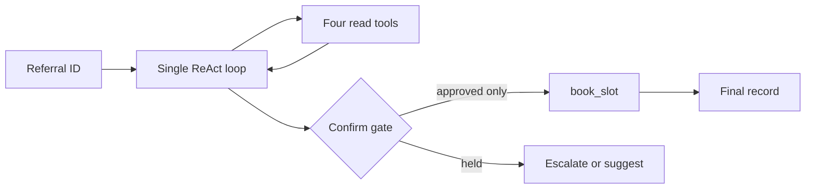

# PE6201 A2 Applied AI System

## Problem B — Outpatient Referral Coordination

This repository contains one hand-written ReAct agent for outpatient referral coordination. It uses local fixture data and keeps the irreversible `book_slot` action behind a human confirmation gate.

The final design exposes five model-visible tools: four read tools (`get_referral`, `lookup_patient`, `check_referral_criteria` and `get_clinic_slots`) plus the gated write-like action `book_slot`. The evaluation set contains 40 referrals and 60 scheduled trials.

## Submission results

| Measure | Result |
|---|---:|
| Offline scripted evaluation | 60/60 code-check passes |
| Evaluation set | 40 referrals, 60 trials |
| Guardrail suite | 12 checks defined, including 3 malicious free-text cases |
| V1 versus V2 experiment | V2: 48/60, $0.048662 |
| Completed V2 live models | 5 |
| Recommended model | GPT-4.1 mini |
| Expected monthly cost at 4,000 referrals | $5,510.17 |

Read [the results dashboard](docs/RESULTS_DASHBOARD.md) for the consolidated D0–D7 evidence.

## Current evidence status

- The D0 foundation now documents rungs 1–7, the workflow test, ground-truth boundary and reliability arithmetic.
- The D3 script now defines 12 deterministic checks and explicitly verifies at least three malicious free-text attack classes. Run it once and commit the regenerated JSON evidence.
- The D4 human judgement sheet is intentionally marked pending. A named team member must complete and sign it; automated results cannot replace this step.
- D7 contains two controlled baseline → component removed → restored experiments. Run both scripts after the final checkout and commit their generated evidence.

## Architecture



The model chooses the next tool action. Ordinary code enforces the step cap, budget ceiling, action de-duplication, booking eligibility and autonomy gate.

## Reproduce the technical evidence

Run from the repository root. These commands use no network and require no API key:

```powershell
python run_eval.py
python audit_evaluation_set.py
python run_guardrail_checklist.py
python d2_parallel_comparison.py
python demo_loop_failure.py
python demo_tool_contract_failure.py
```

`config.py` is committed with the safe scripted backend. Live model runs are opt-in through `run_model_battery.py`. API keys must never be committed.

## Repository map

| Location | Purpose |
|---|---|
| `agent.py`, `tools.py`, `guardrails.py` | Agent loop, tool contracts and deterministic controls |
| `backends.py`, `prompt.py`, `config.py` | Scripted/live adapters and model protocol |
| `harness.py`, `run_eval.py` | Evaluation and reproducibility |
| `A2_reference_data/` | Professor-provided records plus labelled Problem B extensions |
| `docs/` | D0–D7 design and evidence notes |
| `evidence/` | Machine-readable experiment outputs |
| `results.json` | Current scripted evaluation output |
| `ProblemB_Team_Runbook.ipynb` | Optional guided walkthrough |

## Evidence conventions

Only `complete: true` live files with 60 trials count in final D5 comparisons. Pilot and incomplete provider/protocol files are diagnostics, not model-quality results. Derived JSON/CSV files must be regenerated whenever their source script changes.

## Team declaration

The team declaration is stored in `TEAM_DECLARATION.docx`. `CONTRIBUTIONS.md` records work allocation separately from technical evidence.
