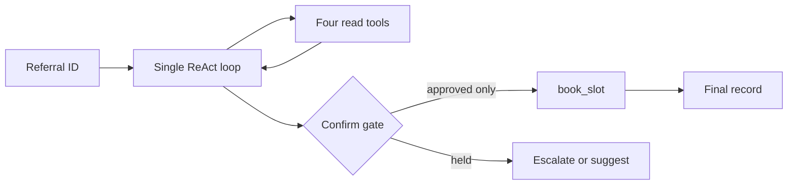

# PE6201 A2 Applied AI System

## Problem B Outpatient Referral Coordination

This repository contains a single, hand-written ReAct agent for coordinating
outpatient referrals. It uses local fixture data only and keeps the one
irreversible action, `book_slot`, behind a human confirmation gate.

The submission uses a five-tool V2 poka-yoke contract, a 40-referral
evaluation set (60 scheduled trials), code-layer safety checks, five completed
live-model evaluations, and a three-layer cost-to-serve model.

## Submission results

| Measure | Result |
|---|---:|
| Offline scripted evaluation | 60/60 code-check passes |
| Evaluation set | 40 referrals, 60 trials |
| Code-layer safety checklist | 12/12 passes, including 3 malicious free-text cases |
| V1 versus V2 experiment | V2: 48/60, $0.048662 |
| Completed V2 live models | 5 distinct families |
| Recommended final-comparison model | DeepSeek Chat V3: 51/60 (85.0%) |
| Baseline monthly cost at 4,000 referrals | $5,508.38 |

D6 uses recorded tokens at dated list prices and exact fallback labour
(55 × 10/60), plus a prototype-only fixed-fee assumption of zero.
Provider-reported charges remain a separate comparison, not the baseline.
See [the cost assumptions and limitations](docs/D6_COST_TO_SERVE.md) and
[the report section](docs/D6_SECTION4_REPORT.md).

Read [the results dashboard](docs/RESULTS_DASHBOARD.md) first. It presents
the D0-D7 evidence, model comparison, cost model and controlled failures.

## Important evidence boundary

Automated code checks and human judgement are reported separately. The retained
live-model post-remediation review records 3/10 strict explanation passes; it
is not merged into an automated score. A separate review of the supplied
scripted decision records is documented in
`docs/D4_HUMAN_JUDGEMENT_REVIEW_2026-09-18.md`.

REF-5590 remains a documented label-policy tension. Its record satisfies the
label by recording an unused urgent slot, but that requires a post-red-flag
read-only slot lookup. No unsafe booking occurred, but the lookup is an
avoidable early-exit and turn-minimisation deviation.

## Architecture



The loop is deliberately not a framework or multi-agent system. The model
chooses the next tool action; ordinary code enforces step, budget,
de-duplication, eligibility and autonomy controls.

## Reproduce the submission

Run from the repository root. These commands use no network and require no
API key.

```powershell
python run_eval.py
python audit_evaluation_set.py
python run_guardrail_checklist.py
python d2_parallel_comparison.py
python summarize_live_results.py
python cost_to_serve.py
python demo_loop_failure.py
python demo_tool_contract_failure.py
```

`config.py` is committed with the safe scripted backend. Live model runs are
opt-in through `run_model_battery.py`; API keys are requested only through a
hidden terminal prompt and must never be committed.

## Repository map

| Location | Purpose |
|---|---|
| `agent.py`, `tools.py`, `guardrails.py` | Production agent, tool contract and safety controls |
| `backends.py`, `prompt.py`, `config.py` | Vendor-neutral live adapter and model protocol |
| `harness.py`, `run_eval.py` | Evaluation and reproducibility |
| `A2_reference_data/` | Professor-provided data plus Problem B extensions |
| `docs/` | D0-D7 design and evidence notes |
| `evidence/` | Reproducible machine-readable experiment outputs |
| `results.json` | Current scripted evaluation output |
| `ProblemB_Team_Runbook.ipynb` | Guided walkthrough of one Problem B run |

## Evidence conventions

Only `complete: true` files with 60 trials count in the final D5 model and D6
cost comparisons. Incomplete provider/protocol runs are retained locally as
diagnostics and are never reported as model-quality results.

## Team declaration

The submitted team declaration is retained as `TEAM_DECLARATION.md`.
`CONTRIBUTIONS.md` is a separate factual contribution log. It records completed
work and corroborating commits.
