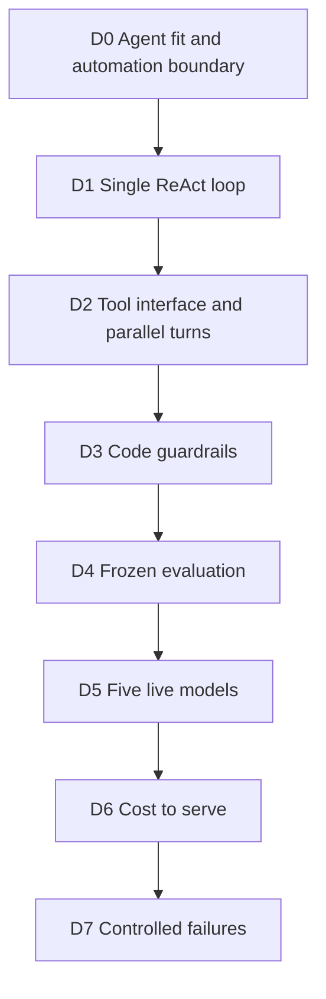
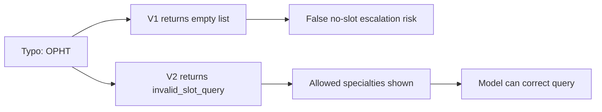

# Submission Results Dashboard

## D0 to D7 evidence map

| Deliverable | Result | Evidence |
|---|---|---|
| D0 | Rung-7 agent; confirmation at booking | `D0_FOUNDATION.md` |
| D1 | Single hand-written ReAct loop | `D1_AGENT_ARCHITECTURE.md` |
| D2 | 5 tools; REF-5602: 6 calls in 4 turns | `D2_TOOL_LAYER.md` |
| D3 | 11/11 safety checks pass | `d3_guardrail_checklist.json` |
| D4 | 40 cases and 60 trials; scripted 60/60 | `d4_evaluation_audit.json` |
| D5 | Five complete V2 live batteries | `D5_MODEL_BATTERY.md` |
| D6 | GPT-4.1 mini: $5,510.17/month | `d6_cost_to_serve.json` |
| D7 | Loop and tool-interface failures reproduced | `D7_FAILURES.md` |

## V2 poka-yoke decision

| Contract | Pass rate | Input tokens | Measured cost | Deployment decision |
|---|---:|---:|---:|---|
| V1 | 49/60 | 468,537 | $0.051530 | Baseline only |
| V2 | 48/60 | 434,084 | $0.048662 | Selected |

V2 costs 5.6% less and prevents an invalid specialty or urgency band from
silently looking like a genuine absence of clinic capacity.

## Five-model V2 battery

| Model | Pass rate | Median turns | Total cost | Expected monthly cost |
|---|---:|---:|---:|---:|
| GPT-4.1 mini | **51/60 (85.0%)** | 4.0 | $0.122501 | **$5,510.17** |
| Gemini 2.5 Flash | 50/60 (83.3%) | 4.0 | $0.194309 | $6,126.29 |
| Gemini 2.5 Flash Lite | 48/60 (80.0%) | 4.0 | $0.048662 | $7,339.24 |
| Llama 3.3 70B | 43/60 (71.7%) | 4.0 | $0.062616 | $10,396.84 |
| GPT-4o mini | 26/60 (43.3%) | 4.0 | $0.047391 | $20,788.49 |

The model token price does not drive the deployment decision. Layer 2 human
fallback dominates the total, so GPT-4.1 mini wins despite not having the
lowest raw API cost.

## Safety and failure evidence

| Threat / failure mechanism | Control | Measured proof |
|---|---|---|
| Prompt injection | Eligibility backstop before booking | Overt and fake-tool attacks blocked |
| Excessive agency | `confirm` gate at `book_slot` | Denied confirmation cannot book |
| Unbounded consumption | 8-turn cap and 60,000-token ceiling | Both controls fire loudly |
| Repetitive loop | Action de-duplication | Removing it raises 4 to 6 turns |
| Bad observation | V2 closed-set tool contract | `OPHT` becomes explicit validation error |

The guardrail categories align with Class 6: prompt injection, excessive
agency and unbounded consumption. The two D7 demonstrations show why prompt
instructions alone are insufficient for loop and interface failures.

## Important limitation

REF-5590 is counted conservatively as a code-check failure in some live runs:
the routing policy correctly stops at a red flag, while the supplied answer
key also asks for evidence that a slot was not taken. This is documented in
`DECISIONS.md` and remains visible in the cost model rather than being removed.
